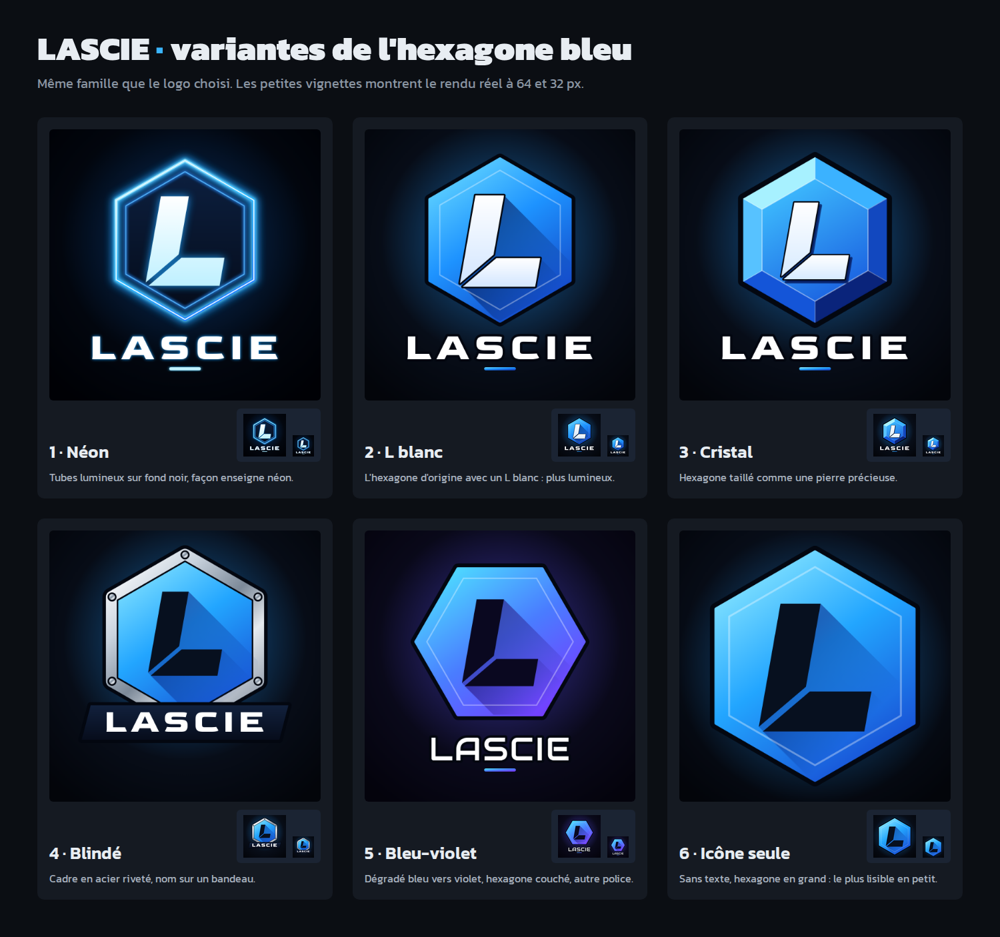

# Logo du clan LASCIE

Trois propositions de logo carré pour l'avatar du groupe Steam, construites sur le nom et la lettre L.

| Proposition | Fichiers | Style |
|---|---|---|
| 1 · Écusson | `lascie_ecusson.png` / `.svg` | Blason de clan classique : bouclier, L doré en relief, trois étoiles, nom sur un ruban |
| 2 · Hexagone | `lascie_hexagone.png` / `.svg` | Style e-sport moderne : L en italique découpé dans un hexagone, nom en lettres larges |
| 3 · Badge rond | `lascie_badge.png` / `.svg` | Insigne rond : nom en arc et L blanc au centre. C'est le plus lisible en tout petit |

- Les **PNG** (1024 × 1024, moins de 500 Ko) sont prêts à être envoyés sur Steam.
- Les **SVG** sont les fichiers sources vectoriels : ils se redimensionnent sans perte et s'ouvrent dans Inkscape, Figma, etc.
- `apercu.png` montre les trois pistes aux tailles d'affichage réelles de Steam (184, 64 et 32 px).

## Variantes de l'hexagone bleu

Le dossier `hexagone_variantes/` décline la proposition 2 en six versions (PNG 1024 × 1024 + SVG) :

| N° | Fichier | Style |
|---|---|---|
| 1 | `lascie_hexa_1_neon` | Tubes lumineux sur fond noir, façon enseigne néon |
| 2 | `lascie_hexa_2_blanc` | L'hexagone d'origine avec un L blanc : plus lumineux |
| 3 | `lascie_hexa_3_cristal` | Hexagone taillé comme une pierre précieuse |
| 4 | `lascie_hexa_4_acier` | Cadre en acier riveté, nom sur un bandeau |
| 5 | `lascie_hexa_5_violet` | Dégradé bleu vers violet, hexagone couché, autre police |
| 6 | `lascie_hexa_6_icone` | Sans texte, hexagone en grand : le plus lisible en petit |

Le halo lumineux du SVG néon est un effet de flou : il s'affiche dans un navigateur, Inkscape ou Figma,
mais pas dans certaines visionneuses basiques. Le PNG, lui, a toujours le bon rendu.

## Mettre le logo sur le groupe Steam

1. Sur la page du groupe (avec un compte administrateur), cliquer sur **Modifier le profil du groupe**.
2. Dans la section **Avatar**, importer le PNG choisi, puis enregistrer.

Steam redimensionne automatiquement l'image en 184, 64 et 32 px (formats JPG ou PNG, 1 Mo maximum).

## Crédits

Polices : Kanit, Goldman, Russo One et Audiowide, toutes sous licence SIL Open Font License. Cette licence permet de
les utiliser librement, y compris dans un logo. Dans les SVG, le texte est converti en tracés : il n'y a
aucune police à installer.
