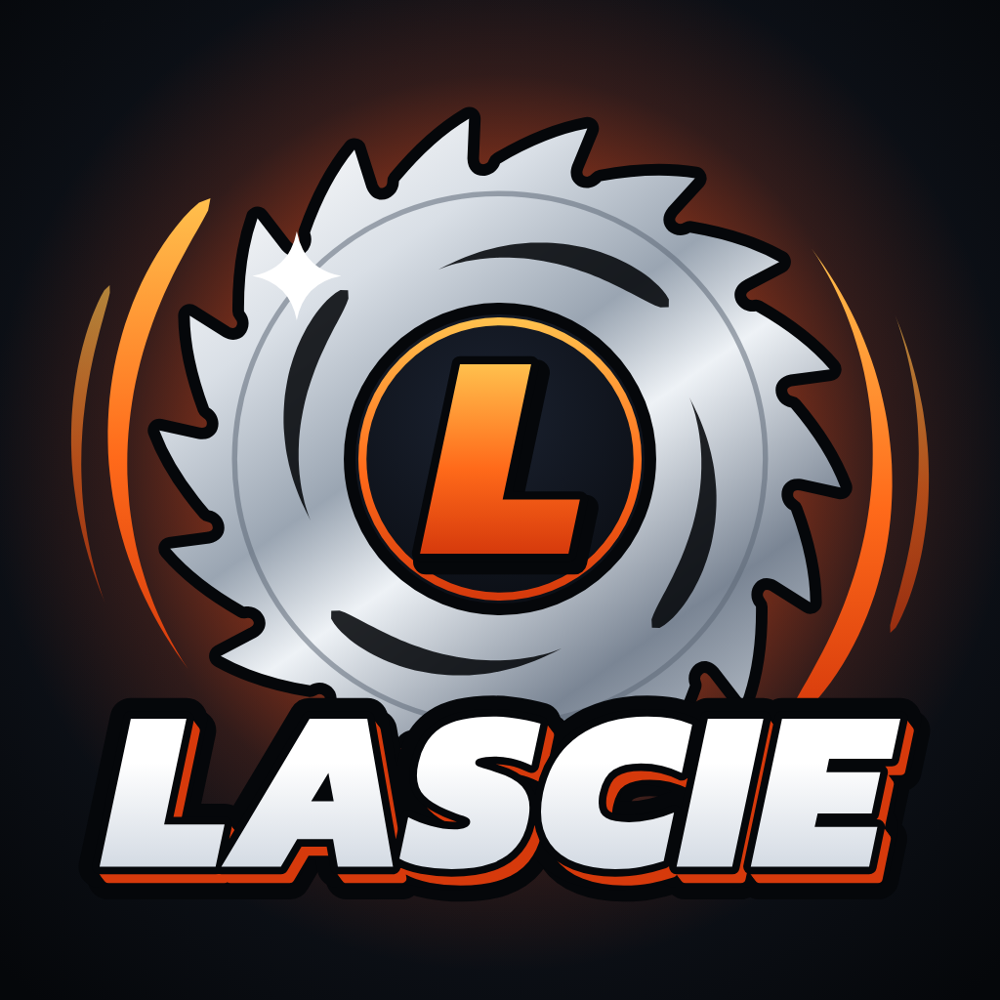
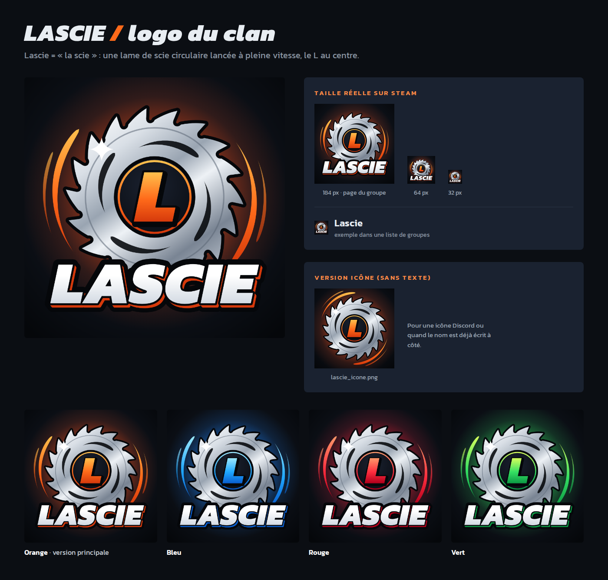

# Logo du clan LASCIE

**Concept :** « Lascie » se lit « la scie ». Le logo montre donc une lame de scie circulaire lancée
à pleine vitesse : les dents sont orientées dans le sens de rotation, avec des découpes en turbine
et des arcs de vitesse. Un **L** est au centre, et le nom est écrit en lettres blanches avec un relief orange.

## Fichiers

| Fichier | Usage |
|---|---|
| `lascie_logo.png` | **À envoyer sur Steam** comme avatar du groupe (1024 × 1024, moins de 1 Mo) |
| `lascie_logo_184.png` | Même logo à la taille d'affichage des avatars Steam (184 × 184) |
| `lascie_logo.svg` | Fichier source vectoriel : se redimensionne sans perte et s'ouvre dans Inkscape, Figma, etc. |
| `lascie_icone.png` / `lascie_icone.svg` | Version sans texte (icône Discord, très petites tailles…) |
| `variantes/` | Le même logo en bleu, rouge et vert (PNG 1024 × 1024) |
| `apercu.png` | Planche d'aperçu : tailles réelles sur Steam et variantes de couleur |

## Mettre le logo sur le groupe Steam

1. Sur la page du groupe (avec un compte administrateur), cliquer sur **Modifier le profil du groupe**.
2. Dans la section **Avatar**, importer `lascie_logo.png`, puis enregistrer.

Steam redimensionne automatiquement l'image en 184, 64 et 32 px (formats JPG ou PNG, 1 Mo maximum).

## Crédits

Police du nom et du L : **Kanit Black Italic**, sous licence SIL Open Font License, qui permet de
l'utiliser librement, y compris dans un logo. Dans les SVG, le texte est converti en tracés : il n'y a
aucune police à installer.
